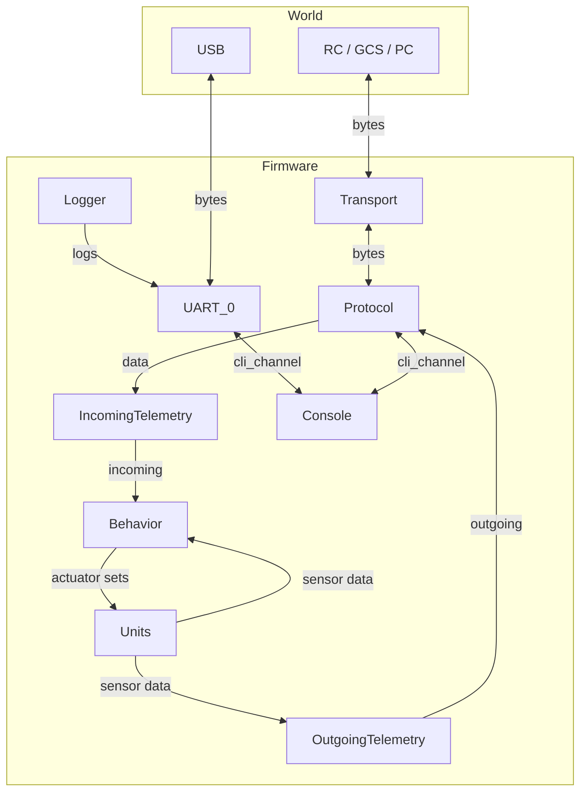

> Машинный перевод. Возможны ошибки.

# Botix: прошивка мобильного робота для ESP32

> **[Read this in English](README.md)**

**Botix-esp32** — это модульная прошивка на C++20 для мобильных роботов на базе ESP32. Она обеспечивает гибкий мост между низкоуровневым железом (моторы, энкодеры, лидар, сервоприводы) и высокоуровневыми контроллерами (ROS 2, приложения на ПК) через настраиваемые транспорты и протоколы.

Эта прошивка — часть [монорепозитория Botix](https://github.com/KiraFlux/botix) и лежит в `botix-esp32/`. 
Прошивка — это проект **PlatformIO**. Все зависимости объявлены и управляются в [`platformio.ini`](./platformio.ini).

| Возможность                    | Описание                                                                                                                 |
| :----------------------------- | :----------------------------------------------------------------------------------------------------------------------- |
| **CLI**                        | Интерактивная консоль через serial с группами команд, справкой, парсингом аргументов (целые, float, bool, строки, enum). |
| **Персистентная конфигурация** | Хранится в NVS ESP32, с CRC и отложенной синхронизацией; два набора: *Device* (железо) и *User* (сеть/загрузка).         |
| **Драйверы**                   | Для моторов (DRV8871), сервоприводов (MG90S), квадратурных энкодеров и лидара LD_06.                                     |
| **Протоколы**                  | RAW (поток байтов) и MAVLink v2 (heartbeat, manual_control, wheel/obstacle distance, serial_control).                    |
| **Транспорты**                 | ESP‑NOW (низкая задержка, peer‑to‑peer) и WiFi UDP (обнаружение через mDNS).                                             |
| **Юниты**                      | Логические группы железа (колёсные моторы, сервы, энкодеры, лидар) с `init/quit/state`.                                  |
| **Поведения**                  | Рабочее поведение с режимами tank/direct drive и таймаутом входных данных.                                               |
| **Системные сервисы**          | Config, mixer, WiFi.                                                                                                     |

> Прошивка в разработке. Сначала посмотрите [текущие ограничения](#ограничения-функциональности).

---

## Быстрый старт

### Что нужно

- PlatformIO Core
- Робот с отладочной платой ESP32

### Сборка и прошивка

```bash
make                # собрать прошивку (окружение esp32dev)
make upload         # собрать и прошить
make monitor        # открыть serial-монитор (115200 бод)
make clean          # очистить артефакты
```

> Команды `make` используют Makefile, лежащий в папке прошивки, который включает общие цели из KiraFlux Toolkit. PlatformIO Core должен быть установлен и доступен в вашем `PATH`.

### Нативные примеры

Некоторые примеры можно запускать нативно (x86) для тестирования:

```bash
pio test -e native          # запустить юнит-тесты (если есть)
pio run -e native -t upload # запустить конкретный пример
```

Примеры в `examples/`:
- `core/cli` — создание консоли CLI и регистрация команд.
- `core/config-registry` — использование реестра конфигурации с кастомной структурой.
- `driver/lidar` — базовое чтение лидара и усреднение по секторам.

---

## CLI — полный справочник команд

CLI — основной интерфейс взаимодействия. Команды сгруппированы по системам.
Используйте `help`, чтобы увидеть список команд, и `help <command>` для подробностей.

| Группа        | Команда      | Аргументы        | Описание                                                                                 |
| :------------ | :----------- | :--------------- | :--------------------------------------------------------------------------------------- |
| **global**    | `help`       | `[target]`       | Показать справку по команде или группе.                                                  |
| **config**    | `list`       | `[path_hint]`    | Вывести все поля конфигурации (с фильтром по подстроке).                                 |
|               | `field`      | `<path> [value]` | Получить или задать поле конфигурации (если `value` опущено — печатает текущее).         |
|               | `sync`       | `<device\|user>` | Принудительно синхронизировать набор конфигурации с NVS (загрузка/сохранение).           |
|               | `reset`      | `<device\|user>` | Сбросить набор конфигурации к значениям по умолчанию.                                    |
| **transport** | `status`     | —                | Показать текущий транспорт и активный адрес (если подключён).                            |
|               | `use`        | `<espnow\|wifi>` | Переключить активный транспорт.                                                          |
|               | `connect`    | —                | Установить соединение (для WiFi используется заданный удалённый адрес).                  |
|               | `disconnect` | —                | Разорвать текущее соединение.                                                            |
| **unit**      | `list`       | —                | Вывести все зарегистрированные юниты с их состояниями (`idle/running/failed/suspended`). |
|               | `init`       | `<kind> <index>` | Инициализировать юнит (например, `init wheel_motor 0`).                                  |
|               | `quit`       | `<kind> <index>` | Остановить юнит.                                                                         |
|               | `state`      | `<kind> <index>` | Показать состояние конкретного юнита.                                                    |
| **protocol**  | `set`        | `<raw\|mavlink>` | Выбрать активный протокол.                                                               |

> **Синтаксис:** аргументы в `<>` обязательны; `[]` — опциональны. Пути — это полные ключи реестра (например, `mixer.mode`).

---

## Конфигурация — полный список полей реестра

Все настраиваемые параметры доступны через реестр конфигурации и сохраняются в NVS.  
В таблице ниже перечислены все поля, их тип (`u8`, `i16`, `bool`, `IPv4` и т.д.), значение по умолчанию и описание.

| Ключ                                   | Тип                  | По умолчанию | Описание                                                                      |
| :------------------------------------- | :------------------- | :----------- | :---------------------------------------------------------------------------- |
| **WiFi**                               |                      |              |                                                                               |
| `hostname`                             | `char[32]`           | `"botix"`    | mDNS-имя хоста (доступно как `<hostname>.local`).                             |
| `wifi.enabled`                         | `bool`               | `false`      | Включить режим WiFi-станции.                                                  |
| `wifi.ssid`                            | `char[32]`           | `""`         | SSID точки доступа.                                                           |
| `wifi.password`                        | `char[32]`           | `""`         | Пароль (пусто = открытая сеть).                                               |
| **Boot**                               |                      |              |                                                                               |
| `boot.transport`                       | `enum (espnow/wifi)` | `wifi`       | Транспорт, используемый при запуске.                                          |
| `boot.protocol`                        | `enum (raw/mavlink)` | `mavlink`    | Протокол, используемый при запуске.                                           |
| `boot.init_lidar`                      | `bool`               | `false`      | Автоинициализация лидара при загрузке.                                        |
| **Mixer**                              |                      |              |                                                                               |
| `mixer.mode`                           | `enum (tank/direct)` | `tank`       | Режим микшера (tank или direct drive).                                        |
| `mixer.max_age_ms`                     | `u16`                | `100`        | Максимальный возраст управляющего сигнала (мс); при превышении моторы встают. |
| `mixer.left_sign`                      | `i8`                 | `+1`         | Инвертировать направление левого мотора.                                      |
| `mixer.right_sign`                     | `i8`                 | `+1`         | Инвертировать направление правого мотора.                                     |
| **Телеметрия**                         |                      |              |                                                                               |
| `telem.wheel_dist.enabled`             | `bool`               | `true`       | Включить телеметрию пройденного колёсами расстояния.                          |
| `telem.wheel_dist.period_ms`           | `u32`                | `100`        | Период отправки расстояния колёс (мс).                                        |
| `telem.wheel_dist.ahead_ms`            | `u32`                | `10`         | Время упреждения при опросе (мс).                                             |
| `telem.obstacle_dist.enabled`          | `bool`               | `false`      | Включить телеметрию расстояния до препятствий (лидар).                        |
| `telem.obstacle_dist.period_ms`        | `u32`                | `200`        | Период отправки расстояния до препятствий (мс).                               |
| `telem.obstacle_dist.ahead_ms`         | `u32`                | `10`         | Время упреждения при опросе (мс).                                             |
| **Транспорт**                          |                      |              |                                                                               |
| `udp.local_port`                       | `u16`                | `14550`      | Локальный UDP-порт для приёма.                                                |
| `udp.remote_ip`                        | `IPv4`               | `0.0.0.0`    | Удалённый IP-адрес (для WiFi).                                                |
| `udp.remote_port`                      | `u16`                | `14555`      | Удалённый UDP-порт.                                                           |
| **Протокол**                           |                      |              |                                                                               |
| `protocol.mavlink.heartbeat_period_ms` | `u32`                | `2000`       | Период отправки MAVLink heartbeat (мс).                                       |
| **Драйверы**                           |                      |              |                                                                               |
| `lidar.dist_min_mm`                    | `u16`                | `20`         | Минимальное расстояние лидара (мм).                                           |
| `lidar.dist_max_mm`                    | `u16`                | `12000`      | Максимальное расстояние лидара (мм).                                          |
| `lidar.min_intensity`                  | `u8`                 | `15`         | Минимальная интенсивность сигнала.                                            |
| `lidar.baudrate`                       | `u32`                | `115200`     | Скорость UART лидара.                                                         |
| `lidar.rx_buffer_len`                  | `u16`                | `2048`       | Размер буфера приёма UART.                                                    |
| `wheel_encoder.mm_per_tick`            | `f32`                | `1.0`        | Коэффициент пересчёта тиков энкодера в миллиметры.                            |
| `wheel_motor.pwm_hz`                   | `u32`                | `20000`      | Частота PWM моторов (Гц).                                                     |
| `wheel_motor.pwm_bits`                 | `u8`                 | `8`          | Разрядность PWM.                                                              |
| `wheel_motor.max_input`                | `i16`                | `1000`       | Максимальное значение управления мотором.                                     |
| `wheel_motor.dead_zone`                | `u16`                | `10`         | Мёртвая зона (значения ниже игнорируются).                                    |
| `servo.pwm_hz`                         | `u32`                | `50`         | Частота PWM сервоприводов (Гц).                                               |
| `servo.pwm_bits`                       | `u8`                 | `12`         | Разрядность PWM.                                                              |
| `servo.angle_min`                      | `i16`                | `0`          | Минимальный угол сервопривода (градусы).                                      |
| `servo.angle_max`                      | `i16`                | `180`        | Максимальный угол сервопривода (градусы).                                     |
| `servo.pulse_min`                      | `u16`                | `500`        | Минимальная длительность импульса (мкс).                                      |
| `servo.pulse_max`                      | `u16`                | `2500`       | Максимальная длительность импульса (мкс).                                     |


---

## Ограничения функциональности

- **Teardown драйверов** — `quit()` для драйверов моторов, серв и энкодеров только останавливает вывод; полная деинициализация железа не реализована.
- **Парсер лидара** — экспериментальный; может не покрывать все крайние случаи.
- **Поведения** — реализовано только `OperationalBehavior`; инфраструктура переключения есть, но не используется.
- **ESP‑NOW** — управление соединением базовое; широковещательный heartbeat — заглушка.
- **Нет юнит-тестов** — фреймворк для тестов есть, но сами тесты не написаны.
- **Сервисы** — текущая архитектура сервисов (`MixerService`, `WifiService`, `ConfigService`) — временный артефакт рефакторинга, будет перепроектирована.

---

## Архитектура — как это работает

### Иерархия слоёв (сверху вниз)

```
main.cpp (оркестратор)
│
├── Systems (владеют доменами, предоставляют CLI)
│   ├── ConfigSystem
│   ├── TransportSystem
│   ├── ProtocolSystem
│   ├── TelemetrySystem
│   ├── UnitSystem
│   └── BehaviorSystem
│
├── Behaviors (сценарии)
│   └── OperationalBehavior
│
├── Services (временные помощники)
│   ├── MixerService
│   ├── WifiService
│   └── ConfigService
│
├── Units (абстракции железа, каждая содержит свой драйвер(ы))
│   └── UnitRegistry
│       ├── WheelMotorUnit
│       ├── ServoUnit
│       ├── WheelEncoderUnit
│       └── LidarUnit
│
└── Hardware (GPIO, UART, PWM, WiFi, ESP‑NOW)
```

**Заметки:**
- Systems владеют компонентами ниже, но отношение не строго иерархическое: например, `BehaviorSystem` использует `MixerService` и Units.
- Каждый Unit инкапсулирует свой драйвер(ы) — низкоуровневое управление периферией никогда не выставляется наружу за пределы Unit.
- Services — временный слой, в будущем будет отрефакторен.

### Системы и их CLI-группы

| Система           | CLI-группа  | Описание                                                                       |
| :---------------- | :---------- | :----------------------------------------------------------------------------- |
| `ConfigSystem`    | `config`    | Управление персистентной конфигурацией (list, get/set, sync, reset).           |
| `TransportSystem` | `transport` | Переключение транспортов, connect/disconnect, статус.                          |
| `ProtocolSystem`  | `protocol`  | Выбор активного протокола (raw или mavlink).                                   |
| `UnitSystem`      | `unit`      | Список, init, quit и запрос состояния юнитов железа.                           |
| `TelemetrySystem` | `telemetry` | Хранит входящие и исходящие данные телеметрии; используется другими системами. |
| `BehaviorSystem`  | `behavior`  | Управляет текущим поведением (только operational).                             |

### Поток данных



> Эти взаимодействия выполняются постоянно в основном цикле

---

## Лицензия

Этот README — часть документации проекта и распространяется под [CC BY-SA 4.0](../docs/LICENSE).

Исходный код прошивки в этом каталоге (`botix-esp32/`) распространяется под **GNU General Public License v3.0 or later** — полный текст см. в файле [LICENSE](LICENSE).

Полную информацию о лицензиях всех компонентов проекта см. в [README корневого репозитория](../README.md#repository-structure--licensing).
